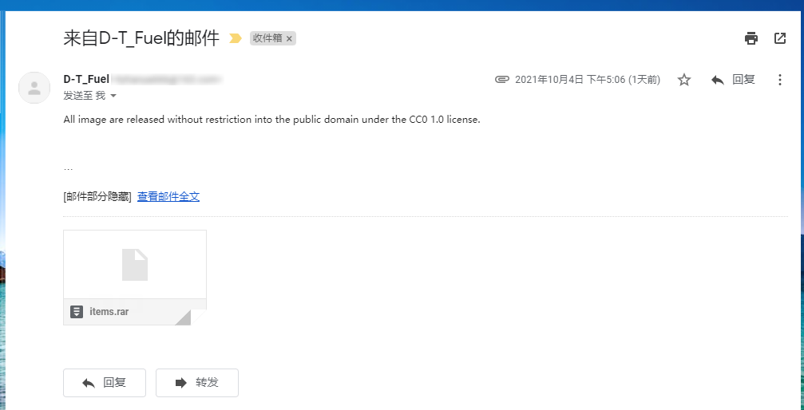

## Introduction 
This file documents the allowed usage of assets sent in via email by a forum user.
As of (05.10.21) a screenshot of an email transcript was recieved from a forum user "DTFuel" sent to us by mamamaruo on Discord stating that the assets created by said forum user are released under the CC0 license, meaning it is compatible with EnderIO.

## The permissions
